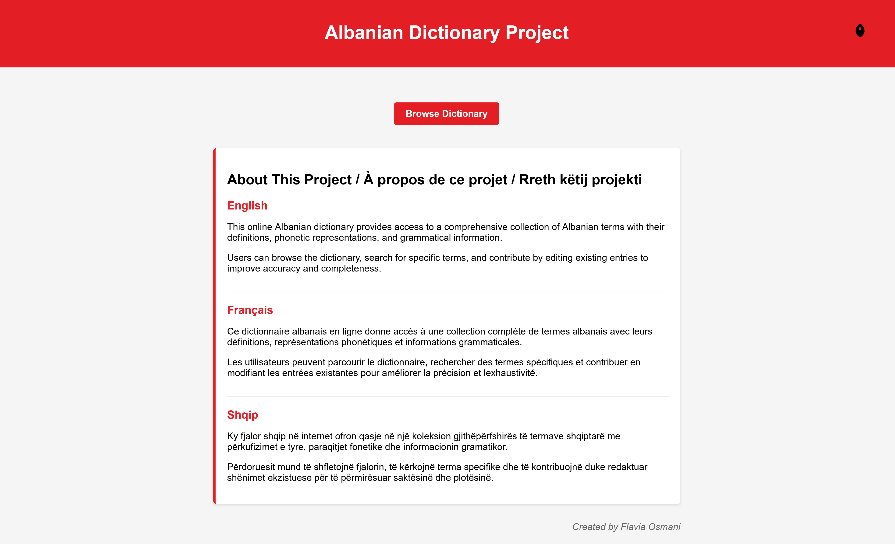
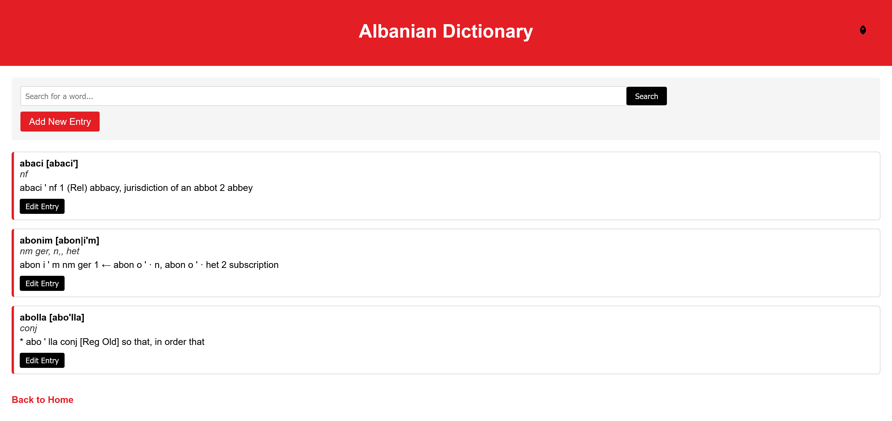
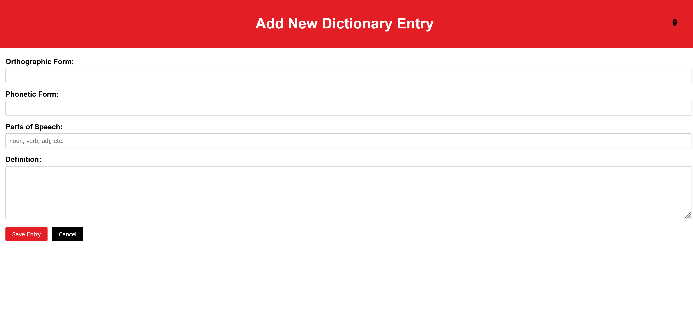

# Albanian Dictionary Project / Projet de Dictionnaire Albanais / Projekti i Fjalorit Shqip

## English

This project is an online Albanian-English dictionary based on the **Albanian-English Dictionary by Leonard Newmark (2005)**, available at [http://www.seelrc.org:8080/albdict/](http://www.seelrc.org:8080/albdict/). The goal of this project is to create a web-based platform for browsing, searching, and editing Albanian dictionary entries, while also improving skills in **BaseX** and contributing to open-source Albanian language resources.

### Features

- **Browse Dictionary**: View a list of Albanian words with their phonetic forms, parts of speech, and definitions.
- **Search Functionality**: Search for specific words in the dictionary.
- **Edit Entries**: Edit existing dictionary entries to improve accuracy and completeness.
- **Add New Entries**: Add new words to the dictionary.
- **Multilingual Support**: View definitions in English, French, and Albanian.
- **User-Friendly Interface**: An intuitive web interface with the Albanian flag colors for easy navigation.

## Français

Ce projet est un dictionnaire albanais-anglais en ligne basé sur le **Dictionnaire albanais-anglais de Leonard Newmark (2005)**, disponible sur [http://www.seelrc.org:8080/albdict/](http://www.seelrc.org:8080/albdict/). L'objectif de ce projet est de créer une plateforme web permettant de parcourir, rechercher et éditer des entrées de dictionnaire albanais, tout en améliorant les compétences en **BaseX** et en contribuant aux ressources linguistiques albanaises open-source.

### Fonctionnalités

- **Parcourir le dictionnaire** : Consultez une liste de mots albanais avec leurs formes phonétiques, parties du discours et définitions.
- **Fonction de recherche** : Recherchez des mots spécifiques dans le dictionnaire.
- **Modifier les entrées** : Modifiez les entrées existantes du dictionnaire pour améliorer la précision et l'exhaustivité.
- **Ajouter de nouvelles entrées** : Ajoutez de nouveaux mots au dictionnaire.
- **Support multilingue** : Consultez les définitions en anglais, français et albanais.
- **Interface conviviale** : Une interface web intuitive aux couleurs du drapeau albanais pour une navigation facile.

## Shqip

Ky projekt është një fjalor shqip-anglisht online bazuar në **Fjalorin Shqip-Anglisht nga Leonard Newmark (2005)**, i disponueshëm në [http://www.seelrc.org:8080/albdict/](http://www.seelrc.org:8080/albdict/). Qëllimi i këtij projekti është të krijojë një platformë në internet për shfletimin, kërkimin dhe redaktimin e shënimeve të fjalorit shqiptar, ndërsa përmirëson gjithashtu aftësitë në **BaseX** dhe kontribuon në burimet e hapura gjuhësore shqiptare.

### Veçoritë

- **Shfletoni Fjalorin**: Shikoni një listë të fjalëve shqipe me format e tyre fonetike, pjesët e ligjëratës dhe përkufizimet.
- **Funksionaliteti i Kërkimit**: Kërkoni për fjalë specifike në fjalor.
- **Redaktoni Hyrjet**: Redaktoni shënimet ekzistuese të fjalorit për të përmirësuar saktësinë dhe plotësinë.
- **Shtoni Hyrje të Reja**: Shtoni fjalë të reja në fjalor.
- **Mbështetje Shumëgjuhëshe**: Shikoni përkufizimet në anglisht, frëngjisht dhe shqip.
- **Ndërfaqe Miqësore për Përdoruesin**: Një ndërfaqe intuitive në internet me ngjyrat e flamurit shqiptar për navigim të lehtë.

## Screenshots / Captures d'écran / Fotografitë e ekranit

### Home Page / Page d'accueil / Faqja kryesore

*The homepage features information about the project in English, French, and Albanian / La page d'accueil présente des informations sur le projet en anglais, français et albanais / Faqja kryesore përmban informacione rreth projektit në anglisht, frëngjisht dhe shqip*

### Browse Dictionary / Parcourir le dictionnaire / Shfletoni Fjalorin

*Browse and search for dictionary entries / Parcourez et recherchez des entrées de dictionnaire / Shfletoni dhe kërkoni për hyrje në fjalor*

### Edit Entry / Modifier l'entrée / Redakto hyrjen

*Edit existing dictionary entries / Modifiez les entrées existantes du dictionnaire / Redaktoni hyrjet ekzistuese të fjalorit*

### Add New Entry / Ajouter une nouvelle entrée / Shto hyrje të re

*Add new words to the dictionary / Ajoutez de nouveaux mots au dictionnaire / Shtoni fjalë të reja në fjalor*

## Technologies Used / Technologies Utilisées / Teknologjitë e Përdorura

- **BaseX**: A native XML database used to store and query the dictionary data / Une base de données XML native utilisée pour stocker et interroger les données du dictionnaire / Një bazë të dhënash XML native e përdorur për të ruajtur dhe pyetur të dhënat e fjalorit.
- **XQuery**: Used for server-side logic and RESTXQ endpoints / Utilisé pour la logique côté serveur et les points de terminaison RESTXQ / Përdoret për logjikën e anës së serverit dhe pikat përfundimtare RESTXQ.
- **HTML/CSS**: For the front-end interface / Pour l'interface front-end / Për ndërfaqen e përdoruesit.
- **RESTXQ**: A framework for building RESTful web services in BaseX / Un framework pour créer des services web RESTful dans BaseX / Një kornizë për ndërtimin e shërbimeve web RESTful në BaseX.

## Project Structure / Structure du Projet / Struktura e Projektit

The project consists of the following files / Le projet se compose des fichiers suivants / Projekti përbëhet nga dosjet e mëposhtme:

1. **`index.xq`**: The homepage of the dictionary / La page d'accueil du dictionnaire / Faqja kryesore e fjalorit.
2. **`view.xq`**: Displays the dictionary entries / Affiche les entrées du dictionnaire / Shfaq hyrjet e fjalorit.
3. **`edit-entry.xq`**: A form for editing dictionary entries / Un formulaire pour éditer les entrées du dictionnaire / Një formular për redaktimin e hyrjeve të fjalorit.
4. **`save-entry.xq`**: Handles the submission of edited entries / Gère la soumission des entrées modifiées / Menaxhon paraqitjen e hyrjeve të redaktuara.
5. **`add-entry.xq`**: A form for adding new entries / Un formulaire pour ajouter de nouvelles entrées / Një formular për shtimin e hyrjeve të reja.
6. **`save-new-entry.xq`**: Handles the submission of new entries / Gère la soumission de nouvelles entrées / Menaxhon paraqitjen e hyrjeve të reja.

## Setup Instructions / Instructions de Configuration / Udhëzimet e Instalimit

### Prerequisites / Prérequis / Parakushtet

- **BaseX**: Install BaseX from [https://basex.org/download/](https://basex.org/download/).
- **Dictionary Data**: The dictionary data is stored in an XML database DICTIONARY.

### Steps / Étapes / Hapat

1. **Install BaseX** / **Installez BaseX** / **Instaloni BaseX**:
   - Download and install BaseX from the official website / Téléchargez et installez BaseX depuis le site officiel / Shkarkoni dhe instaloni BaseX nga faqja zyrtare.
   - Start the BaseX HTTP server / Démarrez le serveur HTTP BaseX / Filloni serverin HTTP BaseX.

2. **Create the Dictionary Database** / **Créez la base de données du dictionnaire** / **Krijoni bazën e të dhënave të fjalorit**:
   - Open the BaseX GUI / Ouvrez l'interface graphique BaseX / Hapni ndërfaqen grafike BaseX.
   - Create a new database named "DICTIONARY" / Créez une nouvelle base de données nommée "DICTIONARY" / Krijoni një bazë të dhënash të re të quajtur "DICTIONARY".
   - Import your dictionary XML data / Importez vos données XML du dictionnaire / Importoni të dhënat tuaja XML të fjalorit.

3. **Deploy the XQuery Files** / **Déployez les fichiers XQuery** / **Vendosni skedarët XQuery**:
   - Place all XQuery files in the BaseX webapp directory / Placez tous les fichiers XQuery dans le répertoire webapp de BaseX / Vendosni të gjitha skedarët XQuery në direktorinë webapp të BaseX.

4. **Access the Application** / **Accédez à l'application** / **Qasuni në aplikacion**:
   - Open your web browser / Ouvrez votre navigateur web / Hapni shfletuesin tuaj të internetit.
   - Navigate to: http://localhost:8080/dictionary / Naviguez vers: http://localhost:8080/dictionary / Navigoni në: http://localhost:8080/dictionary.

## Credits / Crédits / Meritat

- Original dictionary data based on the Albanian-English Dictionary by Leonard Newmark (2005) / Données de dictionnaire originales basées sur le Dictionnaire albanais-anglais de Leonard Newmark (2005) / Të dhënat origjinale të fjalorit bazuar në Fjalorin Shqip-Anglisht nga Leonard Newmark (2005)
- Created by Flavia Osmani / Créé par Flavia Osmani / Krijuar nga Flavia Osmani
